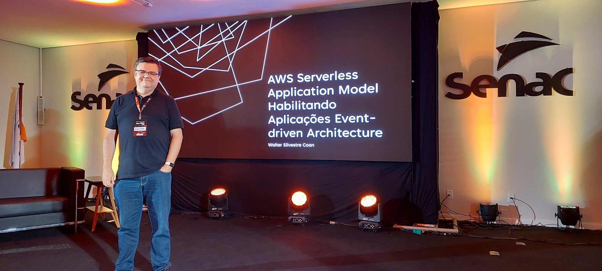

# devTEC 2025 - AWS Serverless Application Model habilitando aplicações Event-Driven Architecture

Apresentação realizada 22/05/2025 no evento devTEC 2025 em Tubarão Santa Catarina sobre o AWS SAM e arquiteturas Event-Driven Architecture

[](https://skillicons.dev)

## Arquitetura


## Evento

[Download Slides](./diagramas/devtec2025-aws-sam-eda.pdf)

### Demo Youtube
[](https://www.youtube.com/watch?v=o7UrJ7gBzGk)

[Grade do Evento](https://devtec.com.br/)

### Demo live
[Aplicação](http://devtec2025.s3-website-sa-east-1.amazonaws.com/)


### Fotos
|  |  |
| -------- | ------- |
|  |  |
|  |  |


### Configuração do ambiente
- Configurar as credenciais programáticas no ambiente AWS

### Criar o projeto SAM
```bash
sam init
```
Selecione a opção 1
```bash
Which template source would you like to use?
        1 - AWS Quick Start Templates
        2 - Custom Template Location
Choice: 1
```
Escolha o template Hello World Example
```bash
Choose an AWS Quick Start application template
        1 - Hello World Example
        2 - Data processing
        3 - Hello World Example with Powertools for AWS Lambda
        4 - Multi-step workflow
        5 - Scheduled task
        6 - Standalone function
        7 - Serverless API
        8 - Infrastructure event management
        9 - Lambda Response Streaming
        10 - GraphQLApi Hello World Example
        11 - Full Stack
        12 - Lambda EFS example
        13 - Serverless Connector Hello World Example
        14 - Multi-step workflow with Connectors
        15 - DynamoDB Example
        16 - Machine Learning
Template: 1
```
Vamos configurar a versão do Python e o empacotamento
```bash
Use the most popular runtime and package type? (python3.13 and zip) [y/N]: n
```

```bash
Which runtime would you like to use?
...
        13 - nodejs18.x
        14 - python3.9
        15 - python3.13
        16 - python3.12
        17 - python3.11
        18 - python3.10
...
Runtime: 16

What package type would you like to use?
        1 - Zip
        2 - Image
Package type: 1
```
Configurações de observabilidade
```bash
Would you like to enable X-Ray tracing on the function(s) in your application?  [y/N]: y

Would you like to enable monitoring using CloudWatch Application Insights? [y/N]: n

Would you like to set Structured Logging in JSON format on your Lambda functions?  [y/N]: y
```

Definindo o nome do projeto
```bash
Project name [sam-app]: sam-eda-app
```

### Primeiro teste

```bash
cd sam-eda-app
sam build
sam local start-api
```
Usar o arquivo teste.rest para fazer a chamada GET Hello World

## Inicio do desenvolvimento

### Criar a Lambda EspectadoresFunction

- Utilizando o pluggin da AWS abra o item APPLICATION BUILDER e clique no icone do Infraestructure Composer
- Clique sobre a caixa do API Gateway e clique em Details
- Crie os seguintes endpoints
  - POST /espectadores
  - ANY /espectadores
  - GET /pontos
- Arraste da palheta um componente Lambda Function e configure
  - Logical ID: EspectadoresFunction
  - Package Type: Zip
  - Source Path: espectadores/
  - Runtime: Python 3.12
- Connecte os endpoints POST /espectadores e ANY /espectadores a lambda
- Arraste da palheta um componente DynamoDB Table e configure
  - Logical ID:  espectadores
  - Partition Key: cep
  - Partition Key Type: string
- Conecte a lambda a tabela do DynamoDB

#### Edição do código da Lambda EspectadoresFunction

- Arquivo requirements.txt
```bash
jsonschema
boto3
```
- Código fonte handler.py
```python
import json
import boto3
import re
import os
from jsonschema import validate, ValidationError


def handler(event, context):
    if(event['httpMethod'] == 'OPTIONS'):
        return {
            'statusCode': 200,
            'body': 'CORS preflight response',
            'headers': {
                "Access-Control-Allow-Headers" : "*",
                "Access-Control-Allow-Origin": "*",
                "Access-Control-Allow-Methods": "OPTIONS,POST,GET"
            }
        }
    
    #conexão com a tabela espectadores no dynamoDB
    print("Inserting item into DynamoDB")
    dynamodb = boto3.client('dynamodb', region_name=os.environ['AWS_REGION'])
    
    schema = {
        "type": "object",
        "properties": {
            "nome": {"type": "string"},
            "cep": {"type": "string"},
        },
        "required": ["nome", "cep"]
    }

    espectador = json.loads(event['body'])
    print(json.dumps(espectador))

    try:
        validate(instance=espectador, schema=schema)
        espectador['cep'] = re.sub(r"[-.\s_,;:()]", "", espectador['cep'])
        dynamodb.put_item(
            TableName=os.environ['ESPECTADORES_TABLE_NAME'],
            Item={
                'nome': {'S': espectador['nome']},
                'cep': {'S': espectador['cep']},
            }
        )
        print(f"Item inserted: {espectador}")

        return {
            'statusCode': 200,
            'body': '{}',
            'headers': {
                "Access-Control-Allow-Headers" : "*",
                "Access-Control-Allow-Origin": "*",
                "Access-Control-Allow-Methods": "OPTIONS,POST,GET"
            }
        }
    except ValidationError as e:
        return {
            'statusCode': 400,
            'body': '{}',
            'headers': {
                "Access-Control-Allow-Headers" : "*",
                "Access-Control-Allow-Origin": "*",
                "Access-Control-Allow-Methods": "OPTIONS,POST,GET"
            }
        }
```
- Altere o arquivo template.yaml para trocar o method ANY por OPTIONS
```yml
ServerlessRestApiOPTIONSespectadores:
  Type: Api
  Properties:
    Path: /espectadores
    Method: OPTIONS
```
- Faça o build e faça a publicação do projeto
```bash
sam build
sam deploy -g
```
- Copie a URL do API Gateway e atualize o arquivo teste.rest nos métodos ### POST Incluir um novo espectador e ### GET Listar todos os pontos
- Execute o método do arquivo text.rest ### POST Incluir um novo espectador

### Criar a Lambda EspectadoresStreamFunction

- Retorne ao Infraestructure Composer e arraste da palheta uma Lambda Function e configure
  - Logical ID: EspectadoresStreamFunction
  - Package Type: Zip
  - Source Path: espectadoresstream/
  - Runtime: Python 3.12
- Conecte a tabela espectadores do DynamoDB a Lambda Function EspectadoresStreamFunction
- Retorne ao Infraestructure Composer e arraste da palheta uma SQS Queue e configure
  - Logical ID: EspectadoresQueue
  - FIFO Queue: NÃO
- Conecte a Lambda Function EspectadoresStreamFunction ao SQS Queue EspectadoresQueue

#### Edição do código da Lambda EspectadoresStreamFunction

- Arquivo requirements.txt
```bash
jsonschema
boto3
```
- Código fonte handler.py
```python
import json
import boto3
import os
from jsonschema import validate, ValidationError

def handler(event, context):
    # conectar no SQS
    sqs = boto3.client('sqs', region_name=os.environ['AWS_REGION'])
    
    # Log the event argument for debugging and for use in local development.
    print(json.dumps(event))
    streamData = event
    for record in streamData['Records']:
        if 'dynamodb' in record and record['eventName'] == 'INSERT':
            dynamodb_record = record['dynamodb']
            print(f"Processing DynamoDB record: {json.dumps(dynamodb_record)}")

            espectador = dynamodb_record['NewImage']

            sqs.send_message(
                QueueUrl=os.environ['ESPECTADORESQUEUE_QUEUE_NAME'],
                MessageBody = json.dumps({
                    'cep': espectador['cep']['S']
                })
            )
            
        else:
            print("No DynamoDB record found in the event.")	
        
    return {}
```

### Criar a Lambda ConvCEPLatLonFunction

- Retorne ao Infraestructure Composer e arraste da palheta uma Lambda Function e configure
  - Logical ID: ConvCEPLatLonFunction
  - Package Type: Zip
  - Source Path: convceplatlon/
  - Runtime: Python 3.12

- Conecte o Subscription SQS Queue EspectadoresQueue a Lambda Function ConvCEPLatLonFunction

- Arraste da palheta um componente DynamoDB Table e configure
  - Logical ID: pontos
  - Partition Key: cep
  - Partition Key Type: string
- Conecte a lambda a tabela do DynamoDB

#### Edição do código da Lambda ConvCEPLatLonFunction

- Arquivo requirements.txt
```bash
jsonschema
boto3
requests
```
- Código fonte handler.py
```python
import json
import requests
import boto3
import os

def handler(event, context):
    # Log the event argument for debugging and for use in local development.
    try:
        dynamodb = boto3.client('dynamodb', region_name=os.environ['AWS_REGION'])

        streamData = event
        for record in streamData['Records']:
            if 'eventSource' in record and record['eventSource'] == 'aws:sqs':
                print(f"Processing SQS message: {record['body']}")
                sqs_message = json.loads(record['body'])
                
                response = requests.get(f"https://brasilapi.com.br/api/cep/v2/{sqs_message['cep']}")
                if response.status_code == 200:
                    data = response.json()
                    
                    if 'latitude' in data['location']['coordinates']:
                        dynamodb.put_item(
                            TableName=os.environ['PONTOS_TABLE_NAME'],
                            Item={
                                'cep': {'S': data['cep']},
                                'cidade': {'S': data['city']},
                                'rua': {'S': "" if data['street'] is None else data['street']},
                                'latitude': {'S': data['location']['coordinates']['latitude']},
                                'longitude': {'S': data['location']['coordinates']['longitude']}
                            }
                        )
                        print("Data inserted into DynamoDB")
                else:
                    print(f"Error fetching data from BrasilAPI: {response.status_code}")
    finally:
        return {
            'statusCode': 200
        }
```

### Criar a Lambda PontosFunction
- Retorne ao Infraestructure Composer e arraste da palheta uma Lambda Function e configure
  - Logical ID: PontosFunction
  - Package Type: Zip
  - Source Path: pontos/
  - Runtime: Python 3.12
- Connecte os endpoints GET /pontos a lambda
- Connecte a lambda a tabela do DynamoDB pontos
- Arquivo requirements.txt
```bash
jsonschema
boto3
```
- Código fonte handler.py
```python
import json
import boto3
import os
from jsonschema import validate, ValidationError

def handler(event, context):
    dynamodb = boto3.client('dynamodb', region_name=os.environ['AWS_REGION'])
    
    lista_pontos = []
    pontos = dynamodb.scan(
        TableName=os.environ['PONTOS_TABLE_NAME']
    )
    
    for item in pontos['Items']:
        ponto = {
            'cep': item['cep']['S'],
            'cidade': item['cidade']['S'],
            'latitude': item['latitude']['S'],
            'longitude': item['longitude']['S'],
            'rua': item['rua']['S']
        }
        lista_pontos.append(ponto)

    return {
            'statusCode': 200,
            'body': json.dumps(lista_pontos),
            'headers': {
                "Access-Control-Allow-Headers" : "*",
                "Access-Control-Allow-Origin": "*",
                "Access-Control-Allow-Methods": "OPTIONS,POST,GET"
            }
        }
```
- Faça o build e faça a publicação do projeto
```bash
sam build
sam sync
```

### Conexão do FrontEnd com o BackEnd
- Altere os arquivos services que estão na pasta, para atualizar a variável apiURL com a URL correta do AWS API Gateway
```bash
/frontend-app/src/app/service/espectador.service.ts
/frontend-app/src/app/service/ponto.service.ts
```
- Execute o projeto do FrontEnd
```bash
cd frontend-app
ng serve
```
- OPCIONAL: crie um bucket S3, habilite web hosting, gere o arquivo de distribuição do Angular e copie para o Bucket
```bash
aws s3api create-bucket --bucket NOME_DO_BUCKET_S3 --acl public-read
aws s3 website s3://NOME_DO_BUCKET_S3 --index-document index.html
ng buil
cd dist/frontend-app/browser/
aws s3 cp . s3://NOME_DO_BUCKET_S3 --recursive
```